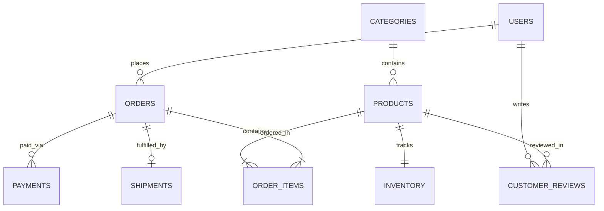

# Jahnavi Priya SQL Database Understanding & Analytics Project

Portfolio project by **Jahnavi Priya**.

A hands-on relational database project designed to practice database normalization (3NF), complex SQL queries (CTEs, window functions, grouping), views, triggers, and query performance tuning.

This repository models an Indian e-commerce data warehouse (**BharatCart**) tracking customers, products, inventory, orders, payments, and shipments. The interactive dashboard is branded as Jahnavi Priya's SQL analytics portfolio.

## Project Overview

The objective of this project is to build and analyze an end-to-end relational schema from scratch:

1. **Schema Design (`01_schema.sql`)**: 10 tables in 3NF with primary keys, foreign keys, `CHECK` constraints, and performance indexes.
2. **Mock Data Generation (`02_seed_data.sql`)**: Realistic multi-month transactional data focusing on Indian metro cities, UPI/Razorpay/PhonePe payment gateways, and local logistics carriers.
3. **Business Queries (`03_analytics_queries.sql`)**: Analytical queries demonstrating revenue growth, customer RFM segmentation, Pareto analysis, rolling trends, inventory alerts, payment gateway health, and metro ARPU.
4. **Views & Automation (`04_procedures_triggers_views.sql`)**: SQL views for executive KPI dashboards and low-stock alerts.
5. **Optimization Guide (`05_optimization_guide.md`)**: Query execution plan notes and indexing strategies.
6. **Interactive Dashboard (`index.html`, `styles.css`, `app.js`)**: A lightweight web interface powered by an in-browser SQLite engine (`sql.js`) and `Chart.js`.

## Database ER Diagram



## Repository Structure

```text
.
|-- 01_schema.sql                    # Database table definitions and constraints
|-- 02_seed_data.sql                  # Mock transactional dataset
|-- 03_analytics_queries.sql          # Business analytics queries
|-- 04_procedures_triggers_views.sql  # SQL views, trigger, and reporting helpers
|-- 05_optimization_guide.md          # Indexing benchmarks and EXPLAIN notes
|-- app.js                            # In-browser SQLite query runner and chart renderer
|-- index.html                        # Web dashboard UI
|-- styles.css                        # UI stylesheet
`-- README.md
```

## Key SQL Topics Covered

- Month-over-month revenue growth with `LAG()`
- Customer RFM segmentation with `NTILE(4)`
- Pareto 80/20 product revenue classification
- Rolling 7-day revenue trends
- Warehouse reorder threshold alerts
- Payment gateway failure-rate analysis
- Metro city average revenue per user

## How to Run Locally

Open `index.html` directly in a web browser, or start a simple HTTP server:

```bash
python -m http.server 8000
```

Then navigate to `http://localhost:8000`.

## Database Command Line

```bash
sqlite3 database.db < 01_schema.sql
sqlite3 database.db < 02_seed_data.sql
sqlite3 database.db < 03_analytics_queries.sql
```

## Deployment

This is a static website and can be deployed directly with GitHub Pages. After pushing the repository to GitHub, enable Pages from GitHub Actions. The included workflow publishes the dashboard from the repository root.
